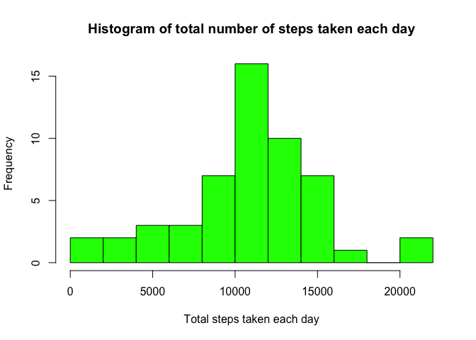

# Assignment1
MikeG  
9 March 2015  

##Data load and preprocessing

Read the data in from CSV, and convert the date variable (which gets read as a factor) to a date.

```r
data<-read.csv('activity.csv')
data$date <- as.Date(strptime(data$date,"%Y-%m-%d"))
```

Let's just check we have the right type of variables, now...

```r
str(data)
```

```
## 'data.frame':	17568 obs. of  3 variables:
##  $ steps   : int  NA NA NA NA NA NA NA NA NA NA ...
##  $ date    : Date, format: "2012-10-01" "2012-10-01" ...
##  $ interval: int  0 5 10 15 20 25 30 35 40 45 ...
```

##Mean total number of steps per day

###Calculating the total number of steps taken per day
Aggregate the original data by date.  
We only want the 'steps' column, and this variable gets named StepsPerDay in the new data frame.


```r
dailySteps<-aggregate(data[,1], list(data$date), sum)
colnames(dailySteps)<-c("Date","StepsPerDay")
str(dailySteps)
```

```
## 'data.frame':	61 obs. of  2 variables:
##  $ Date       : Date, format: "2012-10-01" "2012-10-02" ...
##  $ StepsPerDay: int  NA 126 11352 12116 13294 15420 11015 NA 12811 9900 ...
```

###Histogram
Here's a  histogram of the total number of steps taken each day

```r
histTitle<-c("Histogram of total number of steps taken each day")
xLabel<-c("Total steps taken each day")
hist(dailySteps$StepsPerDay,breaks=10,main=histTitle,xlab=xLabel,col="green")
```

 

###Mean and Median
Ignoring the NA values, here we calculate and report the mean and median of the total number of steps taken per day.

```r
theMean<-mean(dailySteps$StepsPerDay,na.rm = TRUE)
theMedian<-median(dailySteps$StepsPerDay,na.rm = TRUE)
```
* The mean is 10766.19, to 2 decimal places
* The median is 10765.00, to 2 decimal places

##Average daily activity pattern
The data are aggregated by the interval to get the daily average pattern.


```r
dailyPattern<-aggregate(data, list(data$interval), mean,na.rm=TRUE)
```

###Time Series Plot

```r
xLabel<-c("Interval")
yLabel<-c("Number of steps")
plot(dailyPattern$interval,dailyPattern$steps,xlab=xLabel,ylab=yLabel,type="l")
```

 

###Maximum Steps
Which 5-minute interval, on average across all the days in the dataset, contains the maximum number of steps?


```r
maxSteps<-subset(dailyPattern,steps==max(dailyPattern$steps))[4]
```

* The maximum number of steps is during the 835 interval.

##Imputing missing values

###Missing values
Calculate and report the total number of missing values in the dataset (i.e. the total number of rows with NAs)

```r
numMissingVals<-length(data[is.na(data$steps),1])
missing<-data[is.na(data$steps),]
```
The total number of missing values is 2304.

Notice, that all missing data are for complete days...

```r
table(missing$date)
```

```
## 
## 2012-10-01 2012-10-08 2012-11-01 2012-11-04 2012-11-09 2012-11-10 
##        288        288        288        288        288        288 
## 2012-11-14 2012-11-30 
##        288        288
```

... so replacing NA values with the mean for that 5-minute interval seems like the best strategy.
There's probably a smarter way of doing this, but this code simply loops through all the data - where there is an NA values - is.na(data$steps[s] - the datum is replaced with the dailyPattern value for this interval.

The newSteps variable (column 4) contains the steps data with NA values replaced.


```r
for (s in 1:dim(data)[1]){
        if (is.na(data$steps[s])) {
            i<-data$interval[s]
            data$newSteps[s]<-subset(dailyPattern,interval==i)$steps
        } else {
            data$newSteps[s]<-data$steps[s]
        }
}
dailyStepsNoNA<-aggregate(data[,4], list(data$date), sum)
colnames(dailyStepsNoNA)<-c("Date","StepsPerDay")
str(dailyStepsNoNA)
```

```
## 'data.frame':	61 obs. of  2 variables:
##  $ Date       : Date, format: "2012-10-01" "2012-10-02" ...
##  $ StepsPerDay: num  10766 126 11352 12116 13294 ...
```

###Histogram
Here's a  histogram of the total number of steps taken each day

```r
histTitle<-c("Histogram of total number of steps taken each day - No NAs")
xLabel<-c("Total steps taken each day")
hist(dailyStepsNoNA$StepsPerDay,breaks=10,main=histTitle,xlab=xLabel,col="green")
```

 

###Mean and Median
Ignoring the NA values, here we calculate and report the mean and median of the total number of steps taken per day.

```r
theMeanNoNA<-mean(dailyStepsNoNA$StepsPerDay,na.rm = TRUE)
theMedianNoNA<-median(dailyStepsNoNA$StepsPerDay,na.rm = TRUE)
```
* The mean is 10766.19, to 2 decimal places
* The median is 10766.19, to 2 decimal places


##Are there differences in activity patterns between weekdays and weekends?
Create a new factor variable in the dataset with two levels – “weekday” and “weekend” indicating whether a given date is a weekday or weekend day.

weeklyData is a copy of the data set with the new 'weekend' field.  The field is converted to a factor.


```r
weeklyData<-transform(data, weekend=as.POSIXlt(date, format='%Y-%m-%d')$wday %in% c(0, 6))
weeklyData$weekend<-factor(ifelse(weeklyData$weekend,"weekend","weekday"))
```

Panel plot containing a time series plot of the 5-minute interval (x-axis) and the average number of steps taken, averaged across all weekday days or weekend days (y-axis).


```r
library(lattice)
plotData<-aggregate(newSteps~interval+weekend, data=weeklyData,mean)
xyplot(newSteps~interval|weekend, data=plotData,layout=c(1,2), type='l')
```

 

